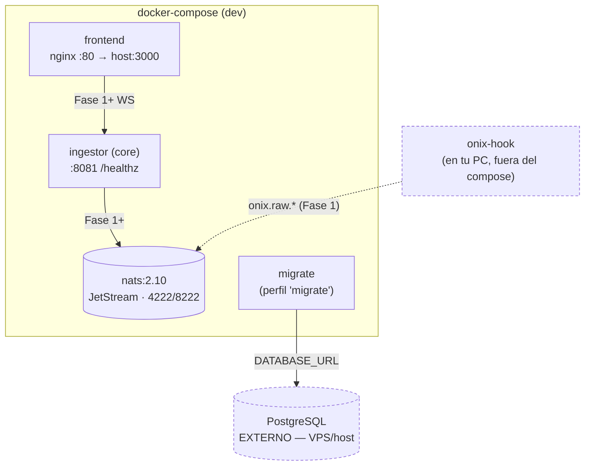

# onix-deploy

**Repo índice + orquestador** de OnixGuard. Junta todos los microservicios en desarrollo (Docker Compose) y, en producción, aloja la infra del VPS y el CI/CD de despliegue.

> Regla del polyrepo: la infra vive **aquí**, una sola vez. Cada servicio se despliega solo, pero `onix-deploy` es el mapa del conjunto.

---

## Mapa del polyrepo

| Repo | Lenguaje | Rol | Estado Fase 0 |
|------|----------|-----|---------------|
| [`onix-contracts`](https://github.com/levapo97-cell/onix-contracts) | JSON Schema → Go/Rust | Contratos compartidos (raw/norm/clean, WS, MCP, REST) | ✅ |
| [`onix-db`](https://github.com/levapo97-cell/onix-db) | SQL | Migraciones + schema de PostgreSQL | ✅ |
| [`onix-ingestor`](https://github.com/levapo97-cell/onix-ingestor) | Go | Core temporal (`/healthz`) → luego valida/normaliza | ✅ core |
| [`onix-guard`](https://github.com/levapo97-cell/onix-guard) | Rust | Redacción + detección + post-mortem | Fase 2 |
| [`onix-recorder`](https://github.com/levapo97-cell/onix-recorder) | Go | Persistencia en Postgres | Fase 1–2 |
| [`onix-orchestrator`](https://github.com/levapo97-cell/onix-orchestrator) | Go | MCP, pausa/reanuda, 12 etapas | Fase 3 |
| [`onix-gateway`](https://github.com/levapo97-cell/onix-gateway) | Go | REST + WebSocket + JWT | Fase 1–3 |
| [`onix-hook`](https://github.com/levapo97-cell/onix-hook) | Go (binario) | Corre en tu PC; publica `onix.raw.*` | Fase 1 |
| [`OnixGuard`](https://github.com/levapo97-cell/OnixGuard) | React | Frontend (3 pantallas) | ✅ andamiaje |

Los repos se clonan como **hermanos** (el compose referencia `../onix-ingestor`, `../OnixGuard`, etc.):

```text
Onix/
├── onix-deploy/      (este repo)
├── onix-contracts/   onix-db/   onix-ingestor/   OnixGuard/   …
```

## 🚀 Correr OnixGuard en local (UN comando)

```bash
make local        # arranca Docker + Postgres + todos los servicios + frontend + onix-agent
# → Panel en http://localhost:3000   (usuario: jefe · password: onix)
make local-down          # bajar (conserva datos)
make local-down ARGS=-v  # bajar y borrar datos
```
`make local` es autocontenido (incluye su propio PostgreSQL efímero y compila/arranca el `onix-agent` si tienes Go). Es la forma recomendada de dejar OnixGuard corriendo en tu PC.

> Para despliegue: frontend en Vercel + backend en el VPS (CD) — ver `docs/RUNBOOK.md`.

## Desarrollo local por piezas (Fase 0)

```bash
cp .env.example .env         # rellena DATABASE_URL (Postgres del VPS/host)
make dev                     # levanta NATS + core + frontend (con build)
# en otra terminal:
make smoke                   # verifica que /healthz responde  ← criterio de Fase 0
make migrate                 # aplica migraciones de onix-db a DATABASE_URL (opcional en Fase 0)
make down                    # baja todo
```

Puertos locales: **frontend** http://localhost:3000 · **ingestor** http://localhost:8081/healthz · **NATS** 4222 (clientes) / 8222 (monitoreo).

`make help` lista todos los targets.

## Qué levanta el compose (y qué NO)



- **PostgreSQL NO está en el compose** (decisión del plan): es externo, entra por `DATABASE_URL`. Desde un contenedor el host es `host.docker.internal`, no `localhost`.
- **onix-hook NO está en el compose**: se compila e instala en tu PC.
- **migrate** vive en un **perfil aparte** (`make migrate`) para que el smoke test de `/healthz` no dependa de que Postgres sea alcanzable.

## Producción y seguridad (resumen; se implementa en Fase 10)

- Todo corre en el **VPS** tras **nginx + Cloudflare**, subdominio `onix.devtoolsdk.com`.
- Tu PC solo abre conexiones **salientes**: NATS con **TLS + token de máquina**, MCP por **HTTPS autenticado**. Sin puertos abiertos en casa.
- Secretos (JWT, credenciales NATS, password fuerte de Postgres) en el **gestor de secretos del VPS/CI**, nunca en el repo ni en la imagen.
- Rutas long-lived (WebSocket, MCP bloqueante): configurar keepalive/timeout en nginx y Cloudflare (el idle ~100s de Cloudflare cortaría long-polls).

## Contenido

```text
docker-compose.yml   # dev: nats + ingestor + frontend + migrate(perfil)
nats/nats.conf       # JetStream (dev, sin TLS)
.env.example         # plantilla de variables (DATABASE_URL, NATS_URL, …)
Makefile             # make dev / migrate / smoke / codegen / …
```

---

*Parte de OnixGuard · Fase 0 (Cimientos). Ver el plan en `OnixGuard/docs/PLAN.md` §1B, §2 y §13.*
